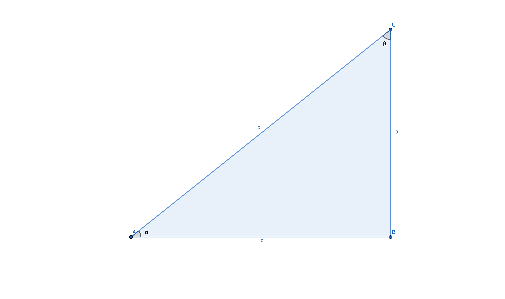

# Capítulo 4. Geometría - Trigonometria 

1. Convierte los siguientes ángulos de grados a radianes:
   1. 
   2. 
   3. 
   4. 
2. Convierte los siguientes ángulos de radianes a grados:
   1. 
   2. 
   3. 
3. En el siguiente triángulo rectángulo, calcula lo que se te pide en los incisos:

   1. Si , calcula })
   2. Si , calcula 
   3. Si , calcula 
